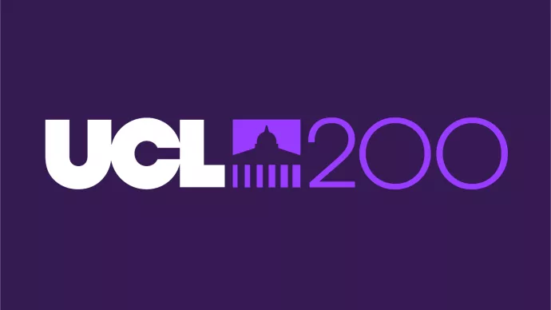

### 7th & 14th May 2026, UCL

# Overview

In this workshop, we will bridge the gap between advanced microscopy data generation and the computational skills required for its analysis. By leveraging open-source tools like [FIJI](https://fiji.sc), [Jupyter notebooks](https://jupyter.org/) and [napari](https://napari.org), participants will learn to automate image analysis, enhancing the precision, efficiency, and reproducibility of their research. This three-day event, led by experienced core facility staff from the Francis Crick Institute and the University of Cardiff, offers a practical approach to mastering quantitative analysis and workflow automation, essential for advancing research across multiple domains.

# Instructors
* [Virginia Silio](https://profiles.ucl.ac.uk/93150-virginia-silio)
* Alan Greig
* [James Gilbert](https://profiles.ucl.ac.uk/62905-james-gilbert)

# Preparation

1. Please remember to bring your laptop (and charger).
2. Please install the required software before the workshop - follow the installation instructions on [this page](Pages/Installation-Instructions.md).
3. Download the workshop data by clicking on the link to the ZIP archive at the top of this page.
4. You will be assigned to a specific group, with whom you will be sitting - your group number will be displayed in the training room.
5. **PLEASE CONTACT US BEFORE THE WORKSHOP IF YOU ENCOUNTER ANY DIFFICULTIES WITH ANY OF THE ABOVE.**

# Program (draft)

### Day 1 — Basics and FIJI *(9:30–16:30)*

| Time | Session | Topic |
|------|---------|-------|
| 9:30–10:45 | Session 1 | **Introduction** — Why automated analysis matters, embracing uncertainty, and understanding metadata |
| 10:45–11:00 | ☕ Break | |
| 11:00–12:30 | Session 2 | **Image Pre-Processing, Segmentation & Analysis** — Thresholding, noise filtering, extracting measurements |
| 12:30–13:30 | 🍽️ Lunch | |
| 13:30–15:15 | Session 3 | **Assembling Pipelines & Interpreting Results** — Counting objects, quantifying morphology and fluorescence |
| 15:15–15:30 | ☕ Break | |
| 15:30–16:30 | Session 4 | **Introduction to Batch Processing** — Recording commands to build a script |

### Day 2 — Python and Jupyter *(9:30–16:30)*

| Time | Session | Topic |
|------|---------|-------|
| 9:30–10:45 | Session 5 | **Introduction to Python** — Environments, Jupyter notebooks, and napari |
| 10:45–11:00 | ☕ Break | |
| 11:00–12:30 | Session 6 | **Reproducible Analysis with Jupyter** — Variables, arrays, quantifying objects in 2D images |
| 12:30–13:30 | 🍽️ Lunch | |
| 13:30–15:15 | Session 6 cont. | **Reproducible Analysis with Jupyter** |
| 15:15-15:30 | ☕ Break | |
| 15:30–16:30 | Session 7 | **Demo: Napari** — Using napari as a viewer from Jupyter |

# Venue

The workshop will take place in Darwin Building, Room 114.

# Thanks!
Huge thanks to [RMS-DAIM](https://www.google.com/search?q=rms+diam&rlz=1C1GCEA_enGB1129GB1129&oq=rms+diam&gs_lcrp=EgZjaHJvbWUqBggAEEUYOzIGCAAQRRg7MggIARAAGBYYHjIICAIQABgWGB4yCAgDEAAYFhgeMggIBBAAGBYYHjIICAUQABgWGB4yCAgGEAAYFhgeMggIBxAAGBYYHjIICAgQABgWGB4yCAgJEAAYFhge0gEIMzk3MWowajeoAgCwAgA&sourceid=chrome&ie=UTF-8) and the [Crick Image Analysis team](https://www.crick.ac.uk/research/platforms-and-facilities/light-microscopy), who developed this material and share with open access licence.

# Previous Workshops

| Date | Venue | Content |
| --- | --- | --- |
| 8 / 9th April 2024 | King's College London | [Click here](Pages/KCL_2024.04.08.md)|
| 24 / 25th April 2024 | Royal College of Surgeons in Ireland | [Click here](Pages/RCSI_2024.04.24.md)|
| 21 / 22nd October 2024 | Francis Crick Institute | [Click here](Pages/Crick_2024.10.21.md)|
| 8 / 9th April 2025 | University of Galway, Ireland | [Click here](https://github.com/FrancisCrickInstitute/introduction-to-image-analysis/blob/main/Pages/Galway_2025.04.08.md)|
| 6 & 20th June 2025 | Francis Crick Institute | [Click here](https://github.com/FrancisCrickInstitute/introduction-to-image-analysis/blob/main/Pages/Crick_2025.06.06.md)|
| 18 / 19th August 2025 | Francis Crick Institute | [Click here](https://github.com/FrancisCrickInstitute/introduction-to-image-analysis/blob/main/Pages/Crick_2025.08.18.md)|
| 27 / 28th October 2025 | Francis Crick Institute | [Click here](https://github.com/FrancisCrickInstitute/introduction-to-image-analysis/blob/main/Pages/Crick_2025.10.27.md)|

# FAQ

1. **Do I need any prior knowledge of image analysis, FIJI or napari to attend?**

    No, this workshop is aimed at complete beginners, but a basic understanding of image acquisition would be beneficial.

2. **Do I need to have any experience of coding?**

    While some basic knowledge would be helpful, it's not essential and even if you have no knowledge of python, Jupyter notebooks or FIJI scripts/macros, you should still apply.

	    

